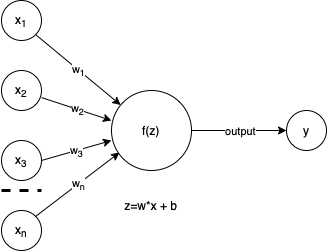
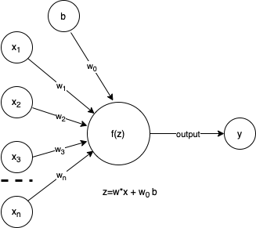

```{r setup, include=FALSE}
knitr::opts_chunk$set(echo = FALSE)
library(knitr)
library(kableExtra)
library(ggpubr)
library(ggplot2)
library(ggExtra)
```

I like computer simulations. That is like dumb science though. What if the computer could actually learn and make decisions. Woah. Perhaps that is a little too Terminator for where we are at currently, but, how far away is that? Probably not terribly far off. As with the MCMC collection, I am going to start at the start of my understanding and see where I get. In the realm of Deep Learning, I particularly like adversarial networks and reinforcement learning so will likely spend more time on those.

Here, I am going to start with what I see as the motivation for DeepLearning, biology and the perceptron. A particularly good coffee table resource is:

```{r, echo=FALSE, include=TRUE}

```

[GoodFellow](http://www.deeplearningbook.org)

    @book{Goodfellow-et-al-2016,
        title={Deep Learning},
        author={Ian Goodfellow and Yoshua Bengio and Aaron Courville},
        publisher={MIT Press},
        note={\url{http://www.deeplearningbook.org}},
        year={2016}
    }

Much of AI/Machine Learning/Deep Learning history is steeped in replicating nature, specifically the functions of the brain. Drilling down into the brain, we get to neurons. Neurons take input from dendrites, pass these as signals through the axon, which are then transmitted through synapses to the dendrites of another neuron. Modelling the functional behavior of neurons is a feat. Enter the perceptron.

 [Wiki neuron](https://en.wikipedia.org/wiki/Neuron)

## Perceptron

The [Wiki](https://en.wikipedia.org/wiki/Perceptron) for Perceptron's is pretty complete and I will just quote it:

> In machine learning, the perceptron is an algorithm for supervised learning of binary classifiers. A binary classifier is a function which can decide whether or not an input, represented by a vector of numbers, belongs to some specific class. It is a type of linear classifier, i.e. a classification algorithm that makes its predictions based on a linear predictor function combining a set of weights with the feature vector.

So, the perceptron is essentially an over simplified model of our understanding of neurons. The perceptron is an algorithm that can be tuned to perform binary classification tasks. Since we are simplifying, let's draw the neuron using input/output labels as our new perceptron.

```{r fig.align = 'center', fig.cap="Simple perceptron."}

```

Above, in our over simplified neuron, we see the components of our perceptron are inputs, x's, importance weights, w's, an activation function, f(z), and output, y. We will talk through these parts and then implement this in a simple learning model.

### Inputs

In our perceptron understanding of neurons, we accept inputs as the start to our algorithm. The inputs can be any type of data, for instance, continuous values such as height, weight, or width, or even discrete values such as counts or class memberships such as word labels in text analytics. When we think of these inputs in our neuronal understanding, they will often be combined with a bias as in the augmented image below. In the neuron, the bias is considered a threshold value below which the neuron will not "fire" or activate. In our perceptron, this is limiting to the case of binary classification, useful, but not complete in that we can use the perceptron for tasks other than binary classification as we will see below.

```{r fig.height=3, fig.align = 'center', fig.cap="Perceptron with bias drawn with draw.io."}

```

### Weights

These are the things we need, the parameters of the model. In a linear models class, these would be our $\beta$'s. The weights are numerical values that indicate the importance of the specific input dimension, ie $x_i$. The perceptron learning algorithm will learn these through iteration, likely using some permutation of gradient descent. As mentioned above, we are adding a bias to the algorithm. This is functionally equivalent to an intercept in a linear model. I have labeled it as "b" and given it a weight, $w_0$, it is convenient to assume b=1 and add this as a dimension to our data.

### Z

We need a function to combine the data with the appropriate weights. This is generally given the sybmol "z" or in some figures the symbol for sum: $\sum$. Setting the bias to 1 and learning the associate weight leaves us with: 

$$
\begin{equation}
\tag{1}
\textbf{z} = \sum_i w_i \ast x_i = \textbf{w}\cdot\textbf{x}
\end{equation}
$$

### Activation function

The activation function, $f(z)$ can take on many forms. In it's simplest form, it is simply the identity, ie $f(z)=z$. This effectively makes the perceptron a linear model. Turning to classification, the activation function becomes the Heavyside step function, or a mapping $z$ to (0,1).

$$
\begin{equation}
\tag{2}
f(z) = 
\begin{cases}
1 \text{ if } z = \textbf{w} \cdot \textbf{x} > 0 \\
0 \text{ otherwise}
\end{cases}
\end{equation}
$$

Activation functions are a varied and active area of research. Common activations functions in neural networks include ReLU, sigmoid, and tanh among others. Choice of activation function depends highly on the goals of the algorithm and will be discussed in its own future post.  Here I will simply give the sigmoid activation function and state that it is appropriate and useful in categorical settings where a probability is desired.  The sigmoid function looks like:

$$
\begin{equation}
\tag{3}
f(z) = \frac{1}{1+e^{-z}} = \frac{1}{1+e^{-\textbf{w}\cdot\textbf{x}}}
\end{equation}
$$
It is useful to note that $\textbf{w}\cdot\textbf{x} \in [-\infty,\infty]$ such that $f(z) \in [0,1]$.  For those of you that have studied logistic regression, this should look familiar.

### Outputs

The output of the perceptron is our decision. If using the step function given in (2), the decision may be something as simple as is the image a cat (+1) or not a cat (0). Turning to linear regression, the output is our z's, or y's if that is more familiar.

## Learning
I was hoping to skip this for now, but want to go through an example, so will need to hit on both scoring a result and improving the score.  Essentially, what we are hitting on is the perceptron receives data, applies weights, adds them according to $z$, and finally calculates the function $f(z)$ to create an output $y$.  This output can be a binary (0,1), categorical discrete (0,1,2,...), or a continuous value on some range [0,1].  We often (always?) are fitting some known data.  Using the known data, we can score how well the current settings on weight fit the data.  We do this via a score function often called a loss function in AI/machine learning speak.  If we can score our result, we should be able to improve our score.  We do this through iterative updates, often using a variant of gradient descent and back propagation.  

### Loss function
The loss function is some measure of how good/bad the model performs based on data.  I am going to leave most of this discussion for a different post and just give two here: MSE or L$_2$ error and binary cross entropy.

#### MSE

MSE, L$_2$, or mean squared error is a measure of error well suited for continuous data.  It is calculated exactly as the name suggests, take the mean of the square of the error.  
$$
\begin{eqnarray}
\tag{4}
MSE &=& \frac{1}{n} \sum_{i=1}^n (y_i - \hat{y}_i)^2 \\
  &=& \frac{1}{n} \sum_{i=1}^n (y_i - \hat{\textbf{w}}\cdot\textbf{x}_i)^2
\end{eqnarray}
$$
Remembering that in the above $y = f(z) = \textbf{w}\cdot\textbf{x}$.  The hat $\hat{}$ signifies this is an estimated value, ie the current output of the perceptron using the current values of weights. The last line is simply noting the $x_i$ are likely vectors representing the inclusion of the bias as an x and perhaps multiple dimensions to the data.  Note that MSE is always positive and gets smaller as the prediction and true values converge.

#### Binary Cross Entropy  
Often we are looking discriminate between categories, cat vs dog, high vs medium vs low, safe vs risky, etc.  In the general case, there can be many categories.  The loss function is effectively a probability distance.


$$
\begin{equation}
\tag{5}
Loss = -\frac{1}{n}\sum_{i}^n y_i log(\hat{y}_i) + (1-y_i)log(1-\hat{y}_i)
\end{equation}
$$
In this case, the labels, $y_i$'s will be 0 or 1 indicating which class the data point belongs to and the $\hat{y}$'s should be considered a probability of the data point belonging to the 1-class.  Note that only one of the two terms will be active based on the actual label and also that the log will always be negative because $0 \le \hat{y}_i \le 1$, hence the "-" out front to ensure we have a positive value.  Our goal is to minimize the loss.

#### Gradient descent
So, we can calculate an error or loss, how do we do better?  We could take random steps and start to get an idea of what the loss surface looks like, but that seems like a good way to compute for ever (not a bad thing if I am making pretty pictures along the way ;) ).  Instead, we will use a little calculus to figure out in which direction we should step.  Remembering from calculus, if we compute the gradient, we will have an indication of slope.

## Example 1: linear model
We have gone way to long without data. :)  


### Multiclass perceptrons

### Multilayer Perceptrons
