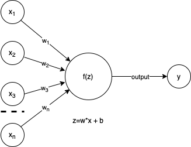
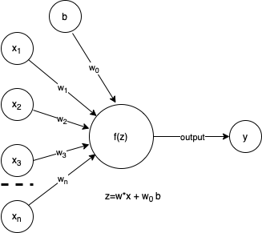

```{r setup, include=FALSE}
knitr::opts_chunk$set(echo = FALSE)
library(knitr)
library(kableExtra)
library(ggpubr)
library(ggplot2)
library(ggExtra)
```

I like computer simulations. That is like dumb science though. What if the computer could actually learn and make decisions. Woah. Perhaps that is a little too Terminator for where we are at currently, but, how far away is that? Probably not terribly far off. As with the MCMC collection, I am going to start at the start of my understanding and see where I get. In the realm of Deep Learning, I particularly like the adversarial networks and reinforcement learning so will likely spend more time on those.

Here, I am going to start with what I see as the motivation for DeepLearning, biology and the perceptron. A particularly good coffee table resource is:

```{r, echo=FALSE, include=TRUE}
include_graphics("../images/Goodfellow.jpeg")
```

[GoodFellow](http://www.deeplearningbook.org)

    @book{Goodfellow-et-al-2016,
        title={Deep Learning},
        author={Ian Goodfellow and Yoshua Bengio and Aaron Courville},
        publisher={MIT Press},
        note={\url{http://www.deeplearningbook.org}},
        year={2016}
    }

Much of AI/Machine Learning/Deep Learning history is steeped in replicating nature, specifically the functions of the brain. Drilling down into the brain, we get to neurons. Neurons take input from dendrites, pass these as signals through the axon, which are then transmitted through synapses to the dendrites of another neuron. Modelling the functional behavior of neurons is a feat. Enter the perceptron.

 [Wiki neuron](https://en.wikipedia.org/wiki/Neuron)

## Perceptron

The [Wiki](https://en.wikipedia.org/wiki/Perceptron) for Perceptron's is pretty complete and I will just quote it:

> In machine learning, the perceptron is an algorithm for supervised learning of binary classifiers. A binary classifier is a function which can decide whether or not an input, represented by a vector of numbers, belongs to some specific class. It is a type of linear classifier, i.e. a classification algorithm that makes its predictions based on a linear predictor function combining a set of weights with the feature vector.

So, the perceptron is essentially an over simplified model of our understanding of neurons. The perceptron is an algorithm that can be tuned to perform binary classification tasks. Since we are simplifying, let's draw the neuron using input/output labels as our new perceptron.

```{r fig.align = 'center', fig.cap="Simple perceptron."}

```

Above, in our over simplified neuron, we see the components of our perceptron are inputs, x's, importance weights, w's, an activation function, f(z), and output, y. We will talk through these parts and then implement this in a simple learning model.

### Inputs

In our perceptron understanding of neurons, we accept inputs as the start to our algorithm. The inputs can be any type of data, for instance, continuous values such as height, weight, or width, or even discrete values such as counts or class memberships such as word labels in text analytics. When we think of these inputs in our neuronal understanding, they will often be combined with a bias as in the augmented image below. In the neuron, the bias is considered a threshold value below which the neuron will not "fire" or activate. In our perceptron, this is limiting to the case of binary classification, useful, but not complete in that we can use the perceptron for tasks other than binary classification as we will see below.

```{r fig.height=3, fig.align = 'center', fig.cap="Perceptron with bias drawn with draw.io."}

```

### Weights

These are the things we need, the parameters of the model. In a linear models class, these would be our $\beta$'s. The weights are numerical values that indicate the importance of the specific input dimension, ie $x_i$. The perceptron learning algorithm will learn these through iteration, likely using some permutation of gradient descent. As mentioned above, we are adding a bias to the algorithm. This is functionally equivalent to an intercept in a linear model. I have labeled it as "b" and given it a weight, $w_0$, it is convenient to assume b=1 and add this as a dimension to our data.

### Z

We need a function to combine the data with the appropriate weights. This is generally given the sybmol "z" or in some figures the symbol for sum: $\sum$. Setting the bias to 1 and learning the associate weight leaves us with:
$$
\begin{equation}
\tag{1}
\textbf{z} = \sum_i w_i \ast x_i = \textbf{w} \cdot \textbf{x}
\end{equation}
$$

### Activation function

The activation function, $f(z)$ can take on many forms. In it's simplest form, it is simply the identity, ie $f(z)=z$. This effectively makes the perceptron a linear model. Turning to classification, the activation function becomes the Heavyside step function, or a mapping $z$ to (0,1).

$$
\begin{equation}
\tag{2}
f(z) = 
\begin{cases}
1 \text{ if } z = \textbf{w} \cdot \textbf{x} > 0 \\
0 \text{ otherwise}
\end{cases}
\end{equation}
$$

Activation functions are a varied and active area of research. Common activations functions in neural networks include ReLU, sigmoid, and tanh among others. Choice of activation function depends highly on the goals of the algorithm and will be discussed in its own future post.

### Outputs

The output of the perceptron is our decision. If using the step function given in (2), the decision may be something as simple as is the image a cat (+1) or not a cat (0). Turning to linear regression, the output is our z's, or y's if that is more familiar.

[](<https://www.simplilearn.com/ice9/free_resources_article_thumb/Perceptron/general-diagram-of-perceptron-for-supervised-learning_4.jpg>)

## Multiclass perceptrons

## Multilayer Perceptrons
